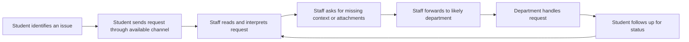
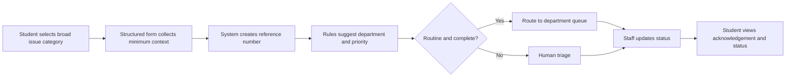

# JNTUH Student Issue Routing — Field Workflow Analysis

**Round 2 field intelligence synopsis for HKAIVERSE**  
**Context:** JNTUH College of Engineering, Hyderabad (JNTUH UCES)  
**Author:** Midilesh Vardhan  
**Date:** 17 September 2026

> This repository is an analysis, not a production system. It contains no student names, roll numbers, marks, fee records, screenshots, or other personal data.

## Problem

Students at a college frequently need help with operational issues such as requests, access problems, document questions, or service complaints. The likely operational problem is not the absence of a way to ask for help; it is that an issue can arrive through different channels and then require manual interpretation and forwarding to the correct department.

A request may be described differently by different students. The person receiving it may need to identify the category, determine the responsible department, ask for missing context, forward it, and later answer the student’s question: “What happened to my request?”

This is a small, observable workflow with repeated handoffs. It is a better automation candidate than a broad claim that “AI will improve college administration.”

## How I Found It

I selected this workflow because I have built an **Intelligent Request Router**, a live Flask application that collects structured student issue details and routes requests to a designated university department. That project exposed the repeated operational steps involved in intake and routing: collecting a description, interpreting the issue, mapping it to a destination, and preserving enough status information for follow-up.

The field context is JNTUH UCES. I did not access institutional databases or collect student records for this analysis. I used the workflow pattern from my project experience and treated any campus-wide operational volume as an estimate rather than as measured institutional data.

**People spoken with:** I did not conduct a formal staff interview for this synopsis. I am stating that limitation explicitly rather than presenting an assumption as an interview finding. The next validation step would be a short conversation with one staff member who receives or routes student requests, followed by an anonymised sample review.

**What I observed:** While developing the Intelligent Request Router, I observed the recurring product and workflow requirements around structured issue intake, category interpretation, department mapping, and status visibility. Those are observations from my own prototype work, not measurements of a JNTUH office.

### What was verified

- The request-routing pattern is technically feasible: I implemented a browser-accessible Flask workflow for structured intake and department-based routing.
- The workflow has repeatable steps: intake, categorisation, routing, acknowledgement, and status follow-up.
- The process can be improved without exposing personal student data in an analysis repository.

### What was not verified

- The actual number of requests handled by any JNTUH UCES office.
- The actual response time or backlog of a particular department.
- Whether every office currently uses the same intake channel.
- Whether the institution would permit automated routing in a live environment.

## Current Workflow

The current-state model below is a workflow hypothesis based on the request-routing pattern described above. It should be validated with an office staff member before any live deployment.



### Repeated manual work

1. Reading an unstructured description and identifying its category.
2. Re-entering or forwarding information that already exists in the original request.
3. Deciding which department or queue should receive the request.
4. Sending an acknowledgement and recording a status.
5. Searching old messages when a student asks for an update.
6. Escalating requests when they remain unresolved.

## Evidence

The evidence is separated into **measured data**, **estimates**, and **assumptions** as required.

### Measured data

| Item | Value | Measurement method |
|---|---:|---|
| Working request-routing prototype | 1 prototype | Personal project implementation: Flask intake and department routing |
| Personal-data records collected for this repository | 0 | Repository review; no student records were collected |
| Institutional request records inspected | 0 | No access to institutional systems was used |

### Estimates for a small pilot — not institutional measurements

These are planning estimates only, included to make the operational impact testable rather than to claim facts about JNTUH UCES.

| Item | Pilot estimate | Basis |
|---|---:|---|
| Requests in a small weekly sample | 30 | Conservative pilot size chosen for manual review |
| Requests needing categorisation or forwarding | 18 (60%) | Working assumption to be validated by sampling |
| Manual handling time per request | 6 minutes | Planning estimate for read, classify, forward, and record |
| Follow-up messages per unresolved request | 1.5 | Planning estimate, not observed campus data |

### Assumptions to test

- A single structured intake form can capture enough context for common request categories.
- A small, maintained routing table can handle most routine categories.
- Students value a reference number and status more than an immediate AI-generated answer.
- Human staff should remain responsible for exceptions, sensitive cases, and final decisions.

## Operational Impact

The main impact is likely to be **waiting time, duplicate work, and lack of visibility**, not merely typing effort.

Using the pilot estimates:

- 18 requests × 6 minutes = **108 minutes per week** of routing-related handling.
- If structured intake reduces avoidable clarification and forwarding work by 40%, the potential saving is 108 × 40% = **43.2 minutes per week** in this small pilot.
- At 52 weeks, that is 43.2 × 52 = **2,246.4 minutes**, or approximately **37.4 hours per year**.

This is not a claim about institutional savings. It is a falsifiable pilot hypothesis. The pilot should measure baseline and post-change handling time using anonymised counts and timestamps only.

## Proposed Future Workflow



### Proposed operating rules

- Use a short form with a fixed category list and a free-text explanation.
- Generate a reference number immediately after submission.
- Store only the minimum information needed for routing and follow-up.
- Keep a human review queue for ambiguous, sensitive, or high-impact requests.
- Show status values such as `Received`, `Needs information`, `Routed`, `In progress`, and `Resolved`.
- Log every routing change so that a staff member can explain what happened.
- Provide a correction and escalation path instead of silently routing a request.

## Where Automation Helps

### Normal software and rules

- Form validation and required fields.
- Reference-number generation.
- Timestamping and status tracking.
- Routing-table lookup based on category.
- Duplicate detection using a reference number and coarse issue fields.
- Staff dashboard for queue and ageing visibility.
- Reminder or escalation rules after a defined time threshold.

### Where AI might help

- Suggesting a category from the student’s free-text description.
- Extracting a small set of non-sensitive fields such as issue type and department keywords.
- Summarising a long description for staff review.
- Detecting that a request is ambiguous and asking for a missing non-sensitive detail.

AI output should be a **suggestion**, not an automatic decision. The interface should display the suggested category, confidence or uncertainty signal, and the human override action.

### Where human judgement is required

- Sensitive welfare, disciplinary, medical, legal, or financial matters.
- Requests involving identity, access rights, or contested records.
- Final priority decisions and escalations.
- Approving a new routing rule.
- Closing a request when the student disputes the outcome.

## ROI / Impact Estimate

The estimate is intentionally small and transparent:

```text
Weekly manual routing time = 18 requests × 6 minutes = 108 minutes
Potential reduction assumption = 40%
Potential weekly time released = 108 × 0.40 = 43.2 minutes
Potential annual time released = 43.2 × 52 = 2,246.4 minutes ≈ 37.4 hours
```

The pilot should be considered successful only if it demonstrates all three outcomes:

1. A reduction in median time from submission to correct queue.
2. Fewer clarification and “what happened?” follow-ups.
3. No increase in incorrectly routed or unresolved requests.

A practical pilot would compare a small anonymised baseline sample with a small sample using structured intake and human-approved routing. The pilot should report counts, durations, correction rate, and unresolved rate—not student identities.

## Risks

- **Misrouting:** A wrong suggestion could delay a request. Mitigation: human approval for routing and an easy reassignment action.
- **Privacy leakage:** Free text may contain personal or sensitive information. Mitigation: data minimisation, access control, retention limits, and no use of student data for model training without explicit governance.
- **False confidence:** A confident AI label may still be wrong. Mitigation: show uncertainty and require human review for low-confidence cases.
- **Exclusion:** A form may be harder for some students than existing channels. Mitigation: provide an assisted or offline alternative.
- **Rule drift:** Departments and responsibilities change. Mitigation: version the routing table and require an owner for updates.
- **Over-automation:** Staff may treat a suggestion as a decision. Mitigation: separate recommendation from approval in the interface.

## Unknowns

- Which official channels JNTUH UCES offices currently prefer for each request type.
- The real weekly volume and category distribution.
- The current median response time and number of unresolved requests.
- The minimum information each department needs to act.
- Whether a reference-number and status workflow already exists in some offices.
- Which categories should never be processed through an automated classifier.
- Whether the institution has an approved data-retention and access policy for such a system.

## AI Usage

AI assistance was used to help structure this synopsis, improve clarity, draft Mermaid workflow diagrams, and check the arithmetic. The workflow choice and technical context came from my own project experience with a Flask-based Intelligent Request Router and my JNTUH UCES context.

AI was **not** used to invent measured campus data. All unverified operational figures are explicitly labeled as estimates or assumptions. No personal student data was uploaded or included.

## Scope Boundary

This repository is an analysis of a manual workflow and a proposed operating model. It is not a promise to build software for JNTUH UCES, not an institutional report, and not evidence that any department has approved this process.
